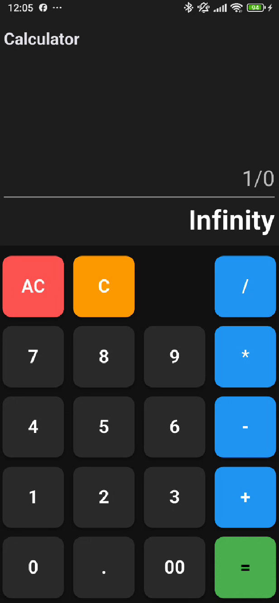
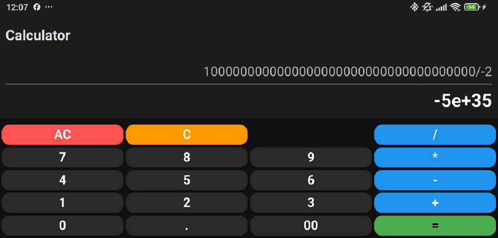

# 🧮 Calculator App - Final Project

**Piscine Mobile - Module 00**  
**Introducción al Desarrollo Mobile con Flutter**

<p align="left">
  
  
  
  
</p>

---

## 📑 Índice

- [🎯 Objetivo del Proyecto](#-objetivo-del-proyecto)
- [💡 Comportamiento Esperado](#-comportamiento-esperado)
- [✨ Características](#-características)
- [🖼️ Capturas de Pantalla](#-capturas-de-pantalla)
- [📂 Estructura del Proyecto](#-estructura-del-proyecto)
- [📚 Conceptos Técnicos para Todos](#-conceptos-técnicos-para-todos)
- [🚀 Instalación y Uso](#-instalación-y-uso)
- [✍️ Autor](#️-autor)

---

## 🎯 Objetivo del Proyecto

¡Bienvenidos al gran final del Módulo 00! Este proyecto es la culminación de todo lo anterior. Hemos pasado de un simple texto a una **herramienta real y útil**. Aquí unimos el diseño visual con la lógica matemática pura.

- **Inteligencia**: La app ya no solo "dibuja" botones, ahora "entiende" lo que escribes.
- **Robustez**: Preparada para errores de usuario (como intentar dividir por cero).
- **Profesionalismo**: Uso de librerías externas para cálculos avanzados.

[⬆ Volver al inicio](#-calculator-app---final-project)

---

## 💡 Comportamiento Esperado

Esta es una calculadora real:
1. **Escribir**: Pulsa números y verás cómo se acumulan en la pantalla.
2. **Operar**: Añade sumas, restas, multiplicaciones...
3. **Calcular**: Al dar al igual (`=`), el resultado aparecerá abajo con precisión decimal.
4. **Corregir**: 
    - Si te equivocas en un número, pulsa `C` para borrar el último.
    - Si quieres empezar de cero, pulsa `AC` (All Clear).
5. **Seguridad**: Si intentas hacer algo imposible (como `5++3`), la app te dirá amablemente "Error" en lugar de cerrarse.

[⬆ Volver al inicio](#-calculator-app---final-project)

---

## ✨ Características

- 🧠 **Cerebro Matemático**: Capaz de resolver ecuaciones respetando paréntesis y prioridades (multiplicar antes que sumar).
- 📜 **Scroll Infinito**: Si escribes una operación larguísima, puedes deslizar el dedo para verla completa.
- 🛡️ **Antifallos**: Sistema de protección que evita que la app se cuelgue ante expresiones mal escritas.

[⬆ Volver al inicio](#-calculator-app---final-project)

---

## 🖼️ Capturas de Pantalla

| Vertical | Horizontal |
|:---:|:---:|
|  |  |

[⬆ Volver al inicio](#-calculator-app---final-project)

---

## 📂 Estructura del Proyecto

```text
calculator_app/
├── lib/
│   └── main.dart         # El código que piensa y dibuja
├── pubspec.yaml          # Donde añadimos el "cerebro" extra (math_expressions)
└── README.md             # El documento que te explica cómo funciona todo
```

[⬆ Volver al inicio](#-calculator-app---final-project)

---

## 📚 Conceptos Técnicos para Todos

¿Cómo transformamos texto en matemáticas? Aquí están los secretos:

### 1. El Paquete `math_expressions` (El experto invitado) 🎓
En programación, no hace falta inventar la rueda cada vez. Para esta app, hemos "contratado" a un experto: una librería externa que sabe mucho de matemáticas. Nosotros le damos un texto como `"5 + 5"` y ella nos devuelve el número `10`.

### 2. El Parser (El traductor) 🗣️
Las computadoras no ven el texto como nosotros. Un **Parser** es como un traductor que coge una frase ("5 + 3 * 2") y la convierte en una estructura que la máquina puede procesar siguiendo las reglas de las matemáticas (jerarquía de operaciones).

### 3. Try-Catch (La red de seguridad) 🎪
Imagina a un trapecista. Normalmente lo hace bien, pero a veces puede fallar. 
En el código, envolvemos el cálculo en un `try-catch`. 
- **Try:** "Intenta calcular esto". 
- **Catch:** "Si algo sale mal (un error), no te asustes, simplemente muestra el mensaje 'Error' en pantalla y sigue funcionando". 
Esto evita que la aplicación se cierre de golpe si el usuario escribe algo sin sentido.

### 4. Substring (Las tijeras de texto) ✂️
Para el botón de borrar (`C`), usamos una función llamada `substring`. Es como coger una cinta de papel con tu texto y usar unas tijeras para cortar exactamente el último trozo.

[⬆ Volver al inicio](#-calculator-app---final-project)

---

## 🚀 Instalación y Uso

### ⚙️ Requisitos de Entorno
- **Flutter SDK:** ^3.19.0
- **Librería extra:** `math_expressions` (se instala sola al ejecutar el comando de abajo).

### Pasos para ejecutar
1. Entra en la carpeta del proyecto.
2. Ejecuta `flutter pub get` para descargar el cerebro matemático.
3. Ejecuta `flutter run` para disfrutar de tu nueva calculadora.

[⬆ Volver al inicio](#-calculator-app---final-project)

---

## ✍️ Autor

**[sternero](https://github.com/STC71)** - junio 2026

---
<p align="center">Proyecto realizado para la Piscine Mobile en 42 Málaga</p>
