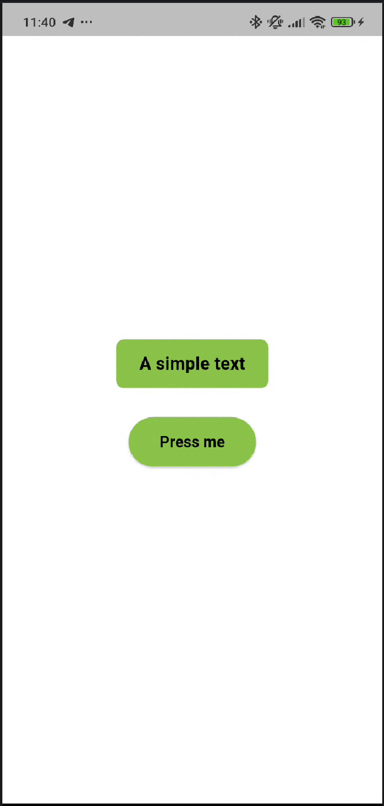
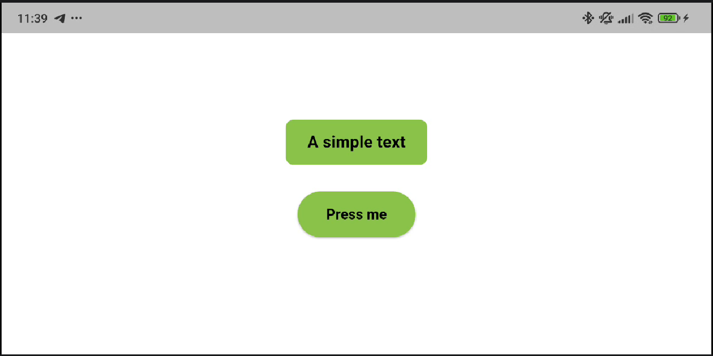

# 📱 Exercise 00 - A Basic Display

**Piscine Mobile - Module 00**  
**Introducción al Desarrollo Mobile con Flutter**

<p align="left">
  
  
  
  
</p>

---

## 📑 Índice

- [🎯 Objetivo del Ejercicio](#-objetivo-del-ejercicio)
- [💡 Comportamiento Esperado](#-comportamiento-esperado)
- [✨ Características](#-características)
- [🖼️ Capturas de Pantalla](#-capturas-de-pantalla)
- [📂 Estructura del Proyecto](#-estructura-del-proyecto)
- [📚 Conceptos Técnicos para Todos](#-conceptos-técnicos-para-todos)
- [🚀 Instalación y Uso](#-instalación-y-uso)
- [✍️ Autor](#️-autor)

---

## 🎯 Objetivo del Ejercicio

El propósito de este primer ejercicio es establecer una base sólida en el desarrollo con Flutter. Se ha diseñado una interfaz mínima pero robusta que cumple con los siguientes requisitos:

- **Interfaz Centralizada**: Implementación de un layout perfectamente centrado.
- **Interacción Básica**: Creación de un botón interactivo.
- **Consola de Debug**: Impresión de logs para verificar la captura de eventos.
- **Fidelidad Visual**: Seguir el esquema de colores y disposición propuesto en el subject.

[⬆ Volver al inicio](#-exercise-00---a-basic-display)

---

## 💡 Comportamiento Esperado

Para validar que el ejercicio funciona correctamente, sigue estos pasos:
1. Inicia la aplicación en un emulador o dispositivo físico.
2. Abre la pestaña **Debug Console** en tu IDE (VS Code o Android Studio).
3. Pulsa el botón que dice "Click Me".
4. **Resultado:** Debe aparecer el mensaje `Button pressed` en la consola de depuración instantáneamente.

[⬆ Volver al inicio](#-exercise-00---a-basic-display)

---

## ✨ Características

- 🎨 **UI Fiel**: Uso de colores específicos (`0xFF8BC34A`) y estilos de contenedores para replicar el diseño objetivo.
- 📱 **Responsivo**: Layout flexible basado en el widget `Center` y `Column` que se adapta a cualquier resolución de pantalla.
- 🛠️ **Material 3**: Uso de las últimas guías de diseño de Google para componentes modernos.
- 🧹 **Código Limpio**: Organización modular y comentarios detallados para facilitar la lectura.

[⬆ Volver al inicio](#-exercise-00---a-basic-display)

---

## 🖼️ Capturas de Pantalla

| Vista en Vertical | Vista en Horizontal / Landscape |
|:---:|:---:|
|  |  |

[⬆ Volver al inicio](#-exercise-00---a-basic-display)

---

## 📂 Estructura del Proyecto

```text
ex00/
├── lib/                  # El cerebro de la app
│   └── main.dart         # Aquí es donde ocurre la magia
├── pubspec.yaml          # La lista de la compra (configuraciones)
└── README.md             # El manual de instrucciones que estás leyendo
```

[⬆ Volver al inicio](#-exercise-00---a-basic-display)

---

## 📚 Conceptos Técnicos para Todos

Si es tu primera vez viendo código de Flutter, no te asustes. Vamos a explicarlo con ejemplos de la vida real:

### 1. ¿Qué es un Widget? (La analogía del LEGO) 🧱
Imagina que Flutter es un juego de **LEGO**. Cada pieza (un botón, un texto, una imagen) es un **Widget**. Para construir la app, simplemente encajamos unas piezas dentro de otras. 
*   **Ejemplo:** Un botón (`ElevatedButton`) contiene una pieza de texto (`Text`).

### 2. El método `build` (El manual de instrucciones) 📖
Cada Widget tiene una función llamada `build`. Es como el manual de instrucciones que le dice a Flutter: *"Para montar esta pantalla, pon un fondo blanco, un texto arriba y un botón abajo"*. Flutter lee este manual constantemente para dibujar la app en tu móvil.

### 3. `Center` y `Column` (El decorador de interiores) 🛋️
- **Center:** Es como colgar un cuadro exactamente en el medio de la pared. No importa lo grande que sea la pared, el cuadro siempre estará en el centro.
- **Column:** Imagina una estantería vertical. Los objetos que pongas dentro se apilarán uno debajo de otro.

### 4. `debugPrint` (El diario de bitácora) 📝
Cuando pulsas el botón, usamos `debugPrint('Button pressed')`. Esto no cambia nada en la pantalla del móvil, pero escribe una nota en una consola secreta que solo los programadores vemos. Es nuestra forma de saber que "el cableado interno" del botón funciona bien.

### 5. `main.dart` (La puerta principal) 🔑
En todo proyecto Flutter hay un archivo llamado `main.dart`. Es como la puerta principal de una casa; es el primer sitio al que entra el sistema operativo para saber cómo arrancar tu aplicación.

[⬆ Volver al inicio](#-exercise-00---a-basic-display)

---

## 🚀 Instalación y Uso

### ⚙️ Requisitos de Entorno
- **Flutter SDK:** ^3.19.0 (El motor de la app)
- **Dart SDK:** ^3.3.0 (El lenguaje en el que escribimos)

### Pasos para ejecutar
1. **Acceder a la carpeta:** `cd mobileModule00/ex00`
2. **Obtener piezas:** `flutter pub get` (Esto descarga las librerías necesarias).
3. **Arrancar:** `flutter run` (Esto enciende el motor y lanza la app).

[⬆ Volver al inicio](#-exercise-00---a-basic-display)

---

## ✍️ Autor

**[sternero](https://github.com/STC71)** - junio 2026

---
<p align="center">Proyecto realizado para la Piscine Mobile en 42 Málaga</p>
