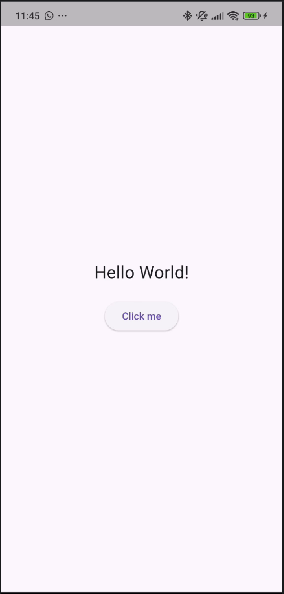
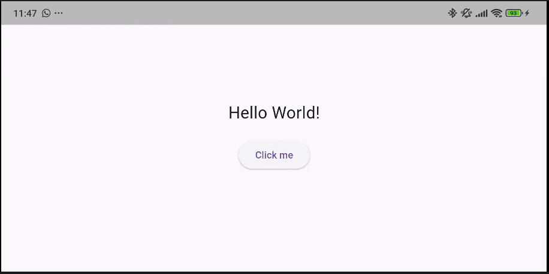

# 📱 Exercise 01 - State Management: Say Hello!

**Piscine Mobile - Module 00**  
**Introducción al Desarrollo Mobile con Flutter**

<p align="left">
  
  
  
  
</p>

---

## 📑 Índice

- [🎯 Objetivo del Ejercicio](#-objetivo-del-ejercicio)
- [💡 Comportamiento Esperado](#-comportamiento-esperado)
- [✨ Características](#-características)
- [🖼️ Capturas de Pantalla](#-capturas-de-pantalla)
- [📂 Estructura del Proyecto](#-estructura-del-proyecto)
- [📚 Conceptos Técnicos para Todos](#-conceptos-técnicos-para-todos)
- [🚀 Instalación y Uso](#-instalación-y-uso)
- [✍️ Autor](#️-autor)

---

## 🎯 Objetivo del Ejercicio

El objetivo de este ejercicio es dar el salto de una interfaz estática (que no cambia) a una **interactiva**. Aprenderemos a manejar la **Memoria** de la aplicación, permitiendo que la pantalla se actualice cuando el usuario interactúa.

- **Gestión de Memoria**: Introducción al `StatefulWidget`.
- **Actualización Visual**: Aprender a "redibujar" la pantalla.
- **Lógica de Alternancia**: Cambiar entre dos mensajes con un solo botón.

[⬆ Volver al inicio](#-exercise-01---state-management-say-hello)

---

## 💡 Comportamiento Esperado

Para validar que el ejercicio funciona correctamente:
1. Al iniciar la app, verás el texto "A simple text" en el centro.
2. Pulsa el botón "Click me".
3. **Resultado:** El texto cambia mágicamente a "Hello World!". 
4. Si pulsas de nuevo, vuelve a decir "A simple text". Es como un interruptor.
5. Además, en la consola de tu ordenador verás que pone `Button pressed` con cada clic.

[⬆ Volver al inicio](#-exercise-01---state-management-say-hello)

---

## ✨ Características

- 🔄 **Cambio Dinámico**: La app "recuerda" en qué estado está.
- ⚡ **Velocidad Rayo**: Flutter actualiza el texto en milisegundos sin que el resto de la pantalla parpadee.
- 🎯 **Lógica Binaria**: Uso de un valor verdadero/falso para controlar lo que ves.

[⬆ Volver al inicio](#-exercise-01---state-management-say-hello)

---

## 🖼️ Capturas de Pantalla

| Estado vertical | Estado horizontal |
|:---:|:---:|
|  |  |

[⬆ Volver al inicio](#-exercise-01---state-management-say-hello)

---

## 📂 Estructura del Proyecto

```text
ex01/
├── lib/
│   └── main.dart         # Aquí gestionamos la memoria y los textos
├── screenshots/          # Fotos de los dos estados
└── README.md             # Esta guía que te explica el "truco"
```

[⬆ Volver al inicio](#-exercise-01---state-management-say-hello)

---

## 📚 Conceptos Técnicos para Todos

¿Cómo hace la app para "recordar" cosas? Aquí te lo explicamos de forma sencilla:

### 1. StatefulWidget (La pizarra vs La foto) 📸/📋
- Un **StatelessWidget** (como el del ex00) es como una **fotografía impresa**: una vez que sale de la cámara, no puedes cambiar lo que hay en ella.
- Un **StatefulWidget** es como una **pizarra**: puedes escribir algo, borrarlo y escribir otra cosa encima. La "pizarra" tiene memoria.

### 2. El método `setState()` (El borrador mágico) 🧽
Cuando pulsas el botón, ejecutamos `setState()`. Imagina que es un comando que le dice a Flutter: *"¡Eh! He cambiado algo en la pizarra. Por favor, borra la pantalla vieja y dibuja la nueva con el cambio que acabo de hacer"*. Sin este comando, aunque cambies el dato en la memoria, el móvil no se enteraría y seguiría mostrando lo mismo.

### 3. El Booleano (El interruptor de la luz) 💡
En el código usamos un `bool _isHello`. Un **bool** es un tipo de dato que solo puede ser dos cosas: **Verdadero (True)** o **Falso (False)**.
Es exactamente como un interruptor de la luz: o está encendida o está apagada. Usamos este "interruptor" para decidir si mostramos "Hello World" o "A simple text".

### 4. El Operador Ternario (La bifurcación) 🛣️
Es una forma elegante de decir: *"Si el interruptor está encendido, muestra esto; si no, muestra aquello"*. 
```dart
Text(_isHello ? "Texto A" : "Texto B")
```

[⬆ Volver al inicio](#-exercise-01---state-management-say-hello)

---

## 🚀 Instalación y Uso

### ⚙️ Requisitos de Entorno
- **Flutter SDK:** ^3.19.0
- **Dart SDK:** ^3.3.0

### Pasos para ejecutar
1. **Entrar en la carpeta:** `cd mobileModule00/ex01`
2. **Preparar la app:** `flutter pub get`
3. **Lanzar:** `flutter run`

[⬆ Volver al inicio](#-exercise-01---state-management-say-hello)

---

## ✍️ Autor

**[sternero](https://github.com/STC71)** - junio 2026

---
<p align="center">Proyecto realizado para la Piscine Mobile en 42 Málaga</p>
