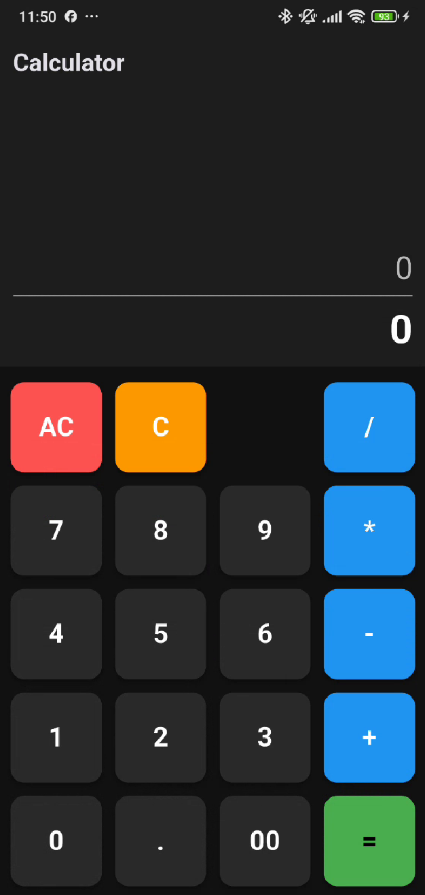
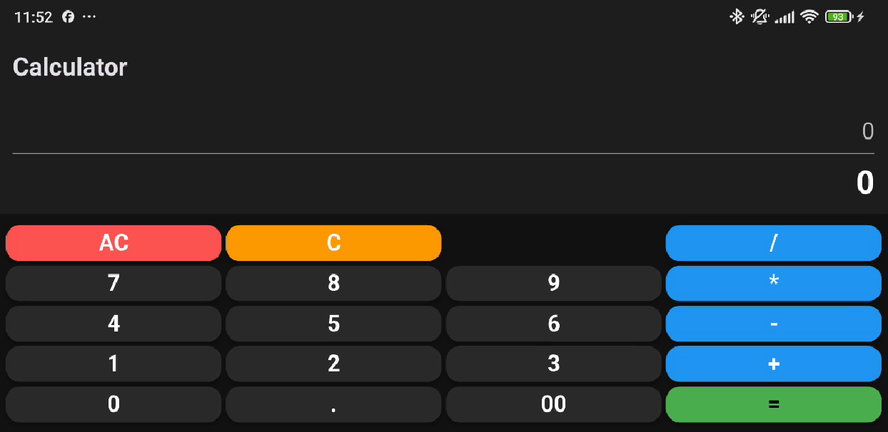

# 📱 Exercise 02 - More Buttons: Calculator UI

**Piscine Mobile - Module 00**  
**Introducción al Desarrollo Mobile con Flutter**

<p align="left">
  
  
  
  
</p>

---

## 📑 Índice

- [🎯 Objetivo del Ejercicio](#-objetivo-del-ejercicio)
- [💡 Comportamiento Esperado](#-comportamiento-esperado)
- [✨ Características](#-características)
- [🖼️ Capturas de Pantalla](#-capturas-de-pantalla)
- [📂 Estructura del Proyecto](#-estructura-del-proyecto)
- [📚 Conceptos Técnicos para Todos](#-conceptos-técnicos-para-todos)
- [🚀 Instalación y Uso](#-instalación-y-uso)
- [✍️ Autor](#️-autor)

---

## 🎯 Objetivo del Ejercicio

Este ejercicio trata sobre **arquitectura visual**. El reto es construir una interfaz compleja (una calculadora) que sea ordenada, atractiva y que no se rompa cuando giramos el móvil.

- **Diseño de Cuadrícula**: Aprender a organizar muchos botones de forma simétrica.
- **Eficiencia de Código**: Crear piezas reutilizables para no escribir lo mismo 20 veces.
- **Adaptabilidad**: Hacer que la app se vea bien tanto en vertical como en horizontal.

[⬆ Volver al inicio](#-exercise-02---more-buttons-calculator-ui)

---

## 💡 Comportamiento Esperado

Para validar la interfaz:
1. Al abrir la app, verás una calculadora completa con números, operadores y una pantalla de resultado.
2. Pulsa cualquier botón (por ejemplo, el "7" o el "+").
3. **Resultado:** Verás en la consola de tu ordenador: `button pressed: 7`. Por ahora, los números no aparecen en la pantalla de la app, eso vendrá después.
4. **Gira el móvil:** La calculadora debe estirarse y ajustarse para aprovechar el espacio a lo ancho.

[⬆ Volver al inicio](#-exercise-02---more-buttons-calculator-ui)

---

## ✨ Características

- 🧩 **Estructura Grid**: Los botones están perfectamente alineados en filas y columnas.
- 📐 **Responsive**: Los botones se hacen más grandes o pequeños según el tamaño de tu pantalla.
- 🎨 **Estilo Dark**: Interfaz profesional en tonos oscuros para no cansar la vista.
- 🛠️ **Código Optimizado**: Uso de funciones inteligentes para generar botones.

[⬆ Volver al inicio](#-exercise-02---more-buttons-calculator-ui)

---

## 🖼️ Capturas de Pantalla

| Vista Vertical | Vista Horizontal |
|:---:|:---:|
|  |  |

[⬆ Volver al inicio](#-exercise-02---more-buttons-calculator-ui)

---

## 📂 Estructura del Proyecto

```text
ex02/
├── lib/
│   └── main.dart         # El esqueleto y diseño de la calculadora
├── android/              # "Papeles" necesarios para que funcione en Android
└── README.md             # El mapa para entender este laberinto de botones
```

[⬆ Volver al inicio](#-exercise-02---more-buttons-calculator-ui)

---

## 📚 Conceptos Técnicos para Todos

¿Cómo ordenamos 20 botones sin volvernos locos? Usamos estas herramientas:

### 1. Rows y Columns (Filas y Columnas) 📏
Es como un tablero de ajedrez o un Excel.
- Usamos una **Column** principal para poner la pantalla arriba y el teclado abajo.
- Dentro del teclado, usamos varias **Rows** (filas). Cada fila contiene 4 botones.

### 2. El Widget Expanded (El material elástico) 🎈
Si pones 4 botones en una fila, ¿cómo sabes cuánto debe medir cada uno? 
Si envuelves un botón en un **Expanded**, le estás diciendo: *"Ocupa todo el espacio que puedas"*. Si los 4 botones son Expanded, se repartirán el ancho de la pantalla a partes iguales automáticamente.

### 3. MediaQuery (El sensor de orientación) 🔄
Tu aplicación tiene un "sensor" llamado **MediaQuery**. Le pregunta al móvil: *"¿Cómo de grande es tu pantalla? ¿Estás tumbado o de pie?"*. 
Con esa información, decidimos si ponemos los botones más altos, más bajos o si cambiamos el tamaño de la letra.

### 4. Funciones Reutilizables (El molde de galletas) 🍪
En lugar de escribir el código de un botón 20 veces (color, forma, sombra, texto...), creamos una función llamada `_buildButton`. 
Es como un **molde de galletas**: definimos la forma una sola vez y luego simplemente le decimos qué sabor (qué texto) queremos para cada galleta. Esto hace que el código sea 10 veces más corto y fácil de leer.

[⬆ Volver al inicio](#-exercise-02---more-buttons-calculator-ui)

---

## 🚀 Instalación y Uso

### ⚙️ Requisitos de Entorno
- **Flutter SDK:** ^3.19.0
- **Hardware:** Funciona en Android, iPhone y navegadores web.

### Pasos para ejecutar
1. `cd mobileModule00/ex02`
2. `flutter pub get`
3. `flutter run`

[⬆ Volver al inicio](#-exercise-02---more-buttons-calculator-ui)

---

## ✍️ Autor

**[sternero](https://github.com/STC71)** - junio 2026

---
<p align="center">Proyecto realizado para la Piscine Mobile en 42 Málaga</p>
